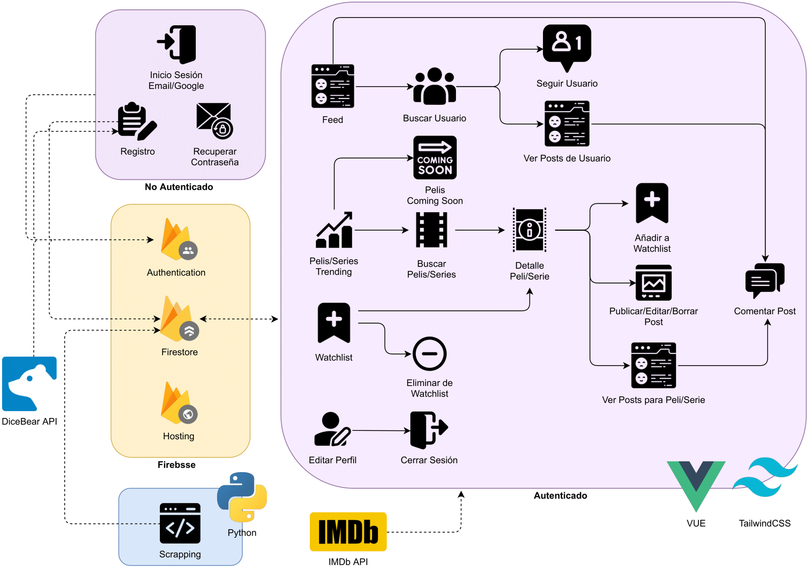

# Kino

[Kino Website](https://watching-b9991.web.app)

Individual project where the knowledge acquired in the subject will be put into practice, taking as an example the IMDb API to query data about movies and tv shows to provide content for the Kino Social Media App.

## Data Model

## End Points

In Firebase Firestore there are no specific end points, instead we use a series of functions in which we specify collections and documents to access the data. In this project we make use of the following functions:
* **`setDoc`** Set the data of a document within a collection, explicitly specifying a document identifier.
* **`addDoc`** Add a new document to a collection, automatically generating the document identifier.
* **`deleteDoc`** Delete a document specifying its identifier.
* **`getDoc`** Retrieve the contents of a single document specifying its identifier.
* **`getDocs`** Retrieve multiple documents with one request by querying documents in a collection.
* **`onSnapshot`** Each time the contents of a document or a collection change the snapshot is updated.

For instance we can get the data associated to a specific user with the `getDoc` function. We first create document reference, in which we specify the document path. `docSnap` contains a snapshot of the data obtained from the query.

`docRef = doc(db, "users", id);  
docSnap = await getDoc(docRef);`

The [Firestore documentation](https://firebase.google.com/docs/firestore) contains plenty of information on how to use all of the functions previously mentioned. 
